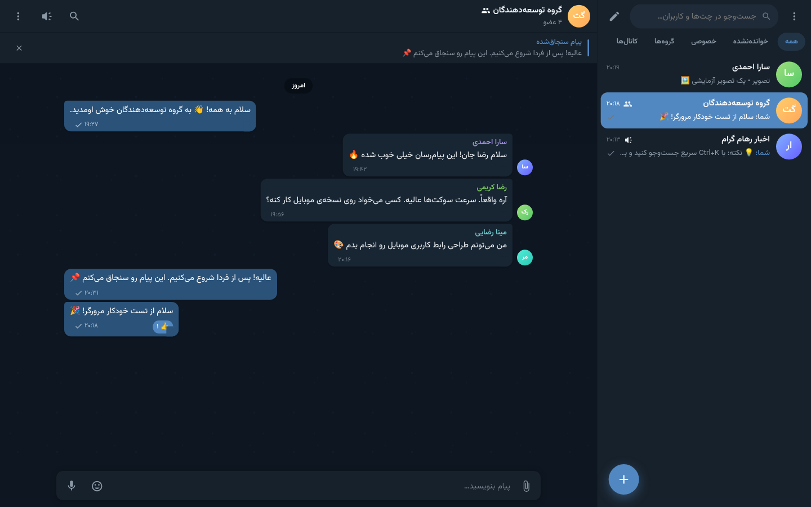
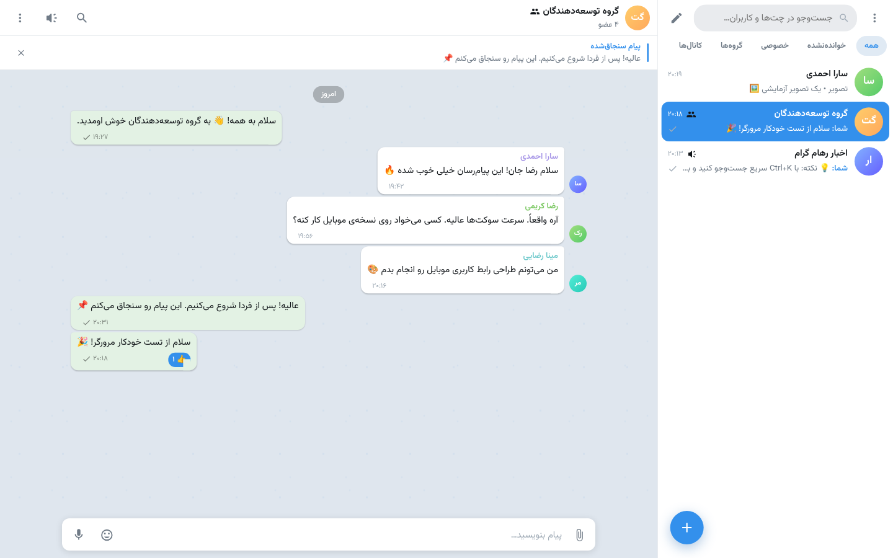
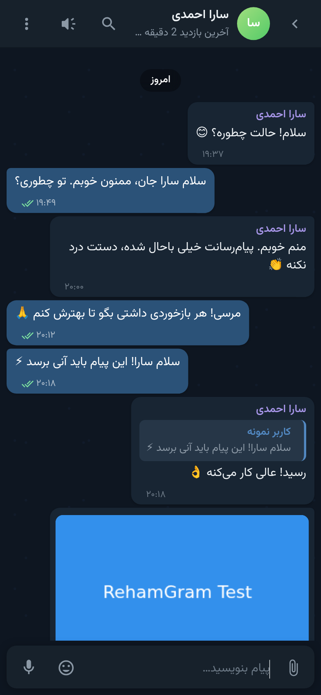

# 💬 RohamGram — A Telegram-like Web Messenger

> راهنمای فارسی: [README.md](./README.md)

A complete, open-source, self-hostable messenger built with **Node.js + Express + Socket.IO + SQLite**, ready to deploy on **Railway** in a few clicks. Private chats, groups, channels, media & voice messages, reactions, live notifications, dark/light themes — all in one project.

    

---

## 📸 Screenshots

| Dark | Light | Mobile |
|:---:|:---:|:---:|
|  |  |  |

---

## ✨ Features

**Messaging**
- ⚡ Real-time delivery over WebSockets with optimistic UI updates
- ✏️ Edit / 🗑️ delete (for everyone or just for you)
- ↩️ Reply, ↪️ forward (multi-select, multi-target), 😀 reactions, 📌 pinned messages
- ✓✓ Read receipts (double tick in DMs, group-wide read state)
- 🔎 Per-chat and global message search, day separators, infinite history scroll

**Media**
- 🖼️ Images with lightbox gallery · 🎬 inline video player · 🎙️ in-browser voice recording
- 🎵 audio player with progress · 📎 any file type with download button
- 📋 paste and 🖱️ drag & drop uploads

**Chats**
- 👤 DMs · 👥 groups (owner/admin/member, ownership transfer) · 📢 channels (admins only post)
- 🔗 invite links · 🌐 public & discoverable chats · 🖼️ editable avatar and bio
- 🔕 per-chat mute · 📥 Saved Messages

**Users**
- 🔐 Sign up / sign in with username or phone, bcrypt-hashed passwords
- 🟢 online presence & last seen · ⌨️ typing indicators
- 📱 active session management · 🔑 password change · ⭐ verified badge

**UI**
- 🌗 dark & light themes (auto-detects OS preference) · 🌍 Persian (RTL) & English (LTR)
- 📱 fully responsive · 🔔 in-app + native browser notifications + sounds
- ⌨️ shortcuts: `Ctrl+K` search, `Ctrl+/` settings, `↑` edit last message
- 📲 installable PWA · 🎨 zero CSS frameworks — hand-written, lightweight

**Security**
- bcrypt password hashing · httpOnly + SameSite JWT cookies
- Helmet with a strict CSP · rate limiting on auth and API
- HTML escaping everywhere (XSS-safe) · dangerous upload types blocked
- path-traversal protection · HTTP Range requests for smooth media streaming

---

## 🚀 Quick start

```bash
npm install
npm run seed     # optional: demo users, a group and a channel
npm start        # → http://localhost:3000
```

Demo login after seeding: **`demo` / `demo1234`**

Run the automated API test suite (25 checks) while the server is running:

```bash
npm test
```

---

## 🚂 Deploy to Railway

1. **Push to GitHub**
   ```bash
   git init && git add . && git commit -m "feat: RohamGram v1.0"
   git branch -M main
   git remote add origin https://github.com/YOUR_USERNAME/my-messenger.git
   git push -u origin main
   ```

2. **Create the project** — on [railway.app](https://railway.app) choose **New Project → Deploy from GitHub repo** and pick your repository. Railway auto-detects `Dockerfile` and `railway.json`.

3. **Add a Volume** (important 🔴) — Service → **Settings → Volumes → Add Volume**, mount path `/data`. Without this, the database and uploads are lost on every deploy.

4. **Set Variables**

   | Variable | Value |
   |---|---|
   | `JWT_SECRET` | a long random string (**required**) |
   | `NODE_ENV` | `production` |
   | `DATA_DIR` | `/data` |
   | `DB_FILE` | `/data/rohamgram.db` |
   | `UPLOAD_DIR` | `/data/uploads` |
   | `MAX_UPLOAD_MB` | `50` |
   | `APP_NAME` | `RohamGram` |

   Generate a secret: `node -e "console.log(require('crypto').randomBytes(48).toString('hex'))"`

5. **Generate a domain** — Settings → Networking → **Generate Domain**, then put that URL into `PUBLIC_URL`.

That's it. Do **not** set `PORT` manually — Railway injects it.

### Other platforms

| Platform | Notes |
|---|---|
| Render | `Procfile` or Docker + a Disk mounted at `/data` |
| Fly.io | `Dockerfile` + a `fly volume` mounted at `/data` |
| Heroku | `Procfile` works, but the filesystem is ephemeral — use S3/R2 for uploads |
| Any VPS | `docker compose up -d`, or `pm2 start server/index.js` |

---

## 📂 Project structure

```
messenger/
├── Dockerfile  railway.json  railway.toml  Procfile  docker-compose.yml
├── scripts/        seed.js · smoke-test.js
└── server/
    ├── index.js    entry point
    ├── app.js      Express setup (security, routes, static)
    ├── socket.js   Socket.IO realtime layer
    ├── config/     environment configuration
    ├── db/         SQLite schema + auto-migrations
    ├── middleware/ JWT auth · error handling
    ├── routes/     auth · users · chats · messages · media · misc
    ├── utils/      helpers · chat logic · presence · file safety · emitter
    └── public/     frontend (vanilla HTML/CSS/JS, PWA manifest, service worker)
```

---

## ⚡ Socket.IO events

**Client → server:** `message:send`, `message:react`, `typing:start`, `typing:stop`, `chat:open`, `chat:close`

**Server → client:** `message:new`, `message:sent`, `message:edited`, `message:deleted`, `message:reaction`, `typing`, `user:presence`, `chat:read`, `chat:created`, `chat:updated`, `chat:pinned`, `chat:memberAdded`, `chat:memberRemoved`

Full REST API reference (in Persian) is documented in [README.md](./README.md#-مستندات-api).

---

## 🧭 Roadmap

WebRTC voice/video calls · end-to-end encryption & secret chats · stories · scheduled messages · bots & webhooks · 2FA and SMS login · live location sharing · Redis adapter for horizontal scaling · PostgreSQL migration · stickers and GIFs

---

## 📄 License

MIT — free to use, modify and distribute.

<div align="center">

**Built with ❤️ and Node.js** — if this project helped you, drop a ⭐ on the repo!

</div>
