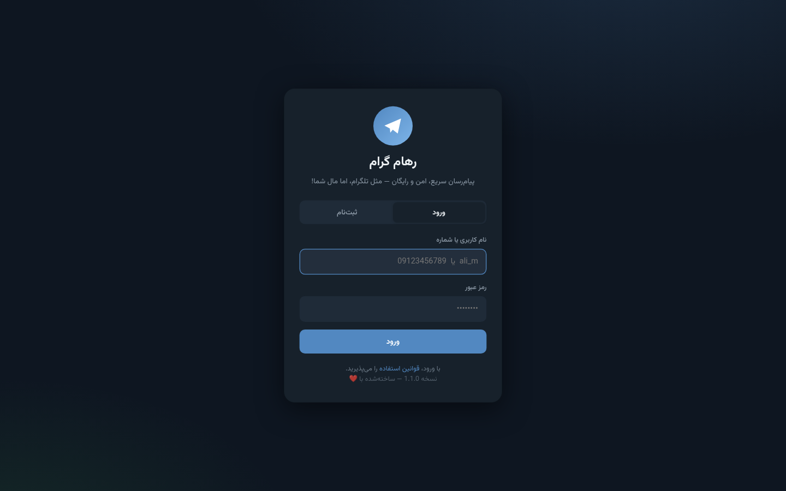
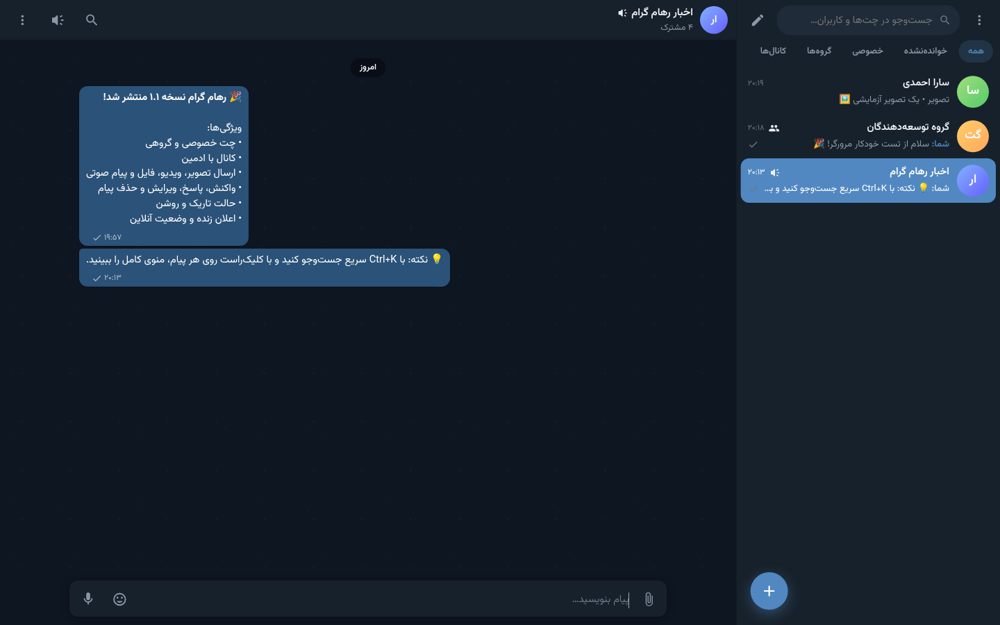
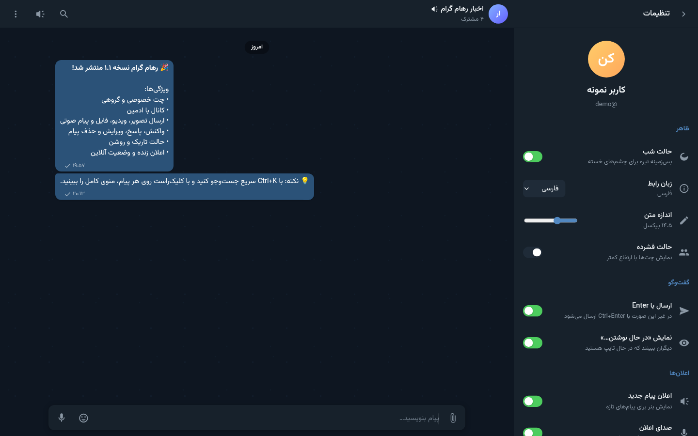

<div dir="rtl">

# 💬 رهام گرام — پیام‌رسان وب شبیه تلگرام

یک پیام‌رسان کامل و **متن‌باز** با Node.js که روی **Railway** (یا هر سرور دیگری) خیلی راحت راه‌اندازی می‌شود.
چت خصوصی، گروه، کانال، ارسال فایل و پیام صوتی، واکنش، اعلان زنده و حالت تاریک/روشن — همه در یک پروژه.

    

</div>

---

<div dir="rtl">

## 📸 نماهایی از برنامه

| حالت تاریک | حالت روشن |
|:---:|:---:|
|  |  |

| صفحه‌ی ورود | کانال | تنظیمات | موبایل |
|:---:|:---:|:---:|:---:|
|  |  |  |  |

---

## ✨ امکانات

### پیام‌ها
- ⚡ **ارسال آنی** با WebSocket (Socket.IO) و به‌روزرسانی خوش‌بینانه در رابط
- ✏️ **ویرایش** و 🗑️ **حذف** پیام (برای همه یا فقط برای خودتان)
- ↩️ **پاسخ (Reply)** به پیام‌ها با پیش‌نمایش
- ↪️ **هدایت (Forward)** یک یا چند پیام به چند چت
- 😀 **واکنش** با ۱۰ ایموجی (👍 ❤️ 🔥 🎉 😂 😮 😢 🙏 👎 💯)
- 📌 **سنجاق کردن** پیام توسط ادمین‌ها
- ✓✓ **تیک خوانده‌شدن** (در چت خصوصی تیک دوم، در گروه وقتی همه خواندند)
- 🔎 **جست‌وجو** در یک چت و جست‌وجوی سراسری در همه‌ی پیام‌ها
- 📅 جداسازی پیام‌ها بر اساس روز و بارگذاری تاریخچه با اسکرول به بالا

### رسانه
- 🖼️ ارسال **تصویر** با پیش‌نمایش و گالری تمام‌صفحه
- 🎬 ارسال **ویدیو** با پخش‌کننده‌ی داخلی
- 🎙️ **ضبط پیام صوتی** مستقیم در مرورگر (MediaRecorder)
- 🎵 پخش **صوت** با نوار پیشرفت
- 📎 ارسال **انواع فایل** (PDF، ZIP، Office و…) با دکمه‌ی دانلود
- 📋 **چسباندن (Paste)** و 🖱️ **کشیدن و رها کردن (Drag & Drop)** فایل

### چت‌ها
- 👤 **چت خصوصی** با جست‌وجوی نام کاربری
- 👥 **گروه** با مالک، ادمین و عضو و امکان واگذاری مالکیت
- 📢 **کانال** (فقط ادمین‌ها پست می‌گذارند) با شمار مشترکین
- 🔗 **لینک دعوت** برای گروه و کانال
- 🌐 **چت عمومی** قابل جست‌وجو و کاوش
- 🖼️ عکس و توضیحات قابل ویرایش برای هر چت
- 🔕 **بی‌صدا کردن** اعلان هر چت
- 📥 **پیام‌های ذخیره‌شده** (چت شخصی شما)

### کاربران
- 🔐 ثبت‌نام و ورود با **نام کاربری یا شماره** و رمز هش‌شده (bcrypt)
- 🖼️ عکس پروفایل، بیو و ویرایش نام کاربری
- 🟢 **وضعیت آنلاین** و «آخرین بازدید»
- ⌨️ نشانگر **«در حال نوشتن…»**
- 📱 **مدیریت دستگاه‌های فعال** و خروج از نشست‌های دیگر
- 🔑 تغییر رمز عبور
- ⭐ تیک آبی تأیید (فیلد `is_verified` در دیتابیس)

### رابط کاربری
- 🌗 **حالت تاریک و روشن** با تشخیص خودکار ترجیح سیستم‌عامل
- 🌍 **فارسی (RTL)** و **انگلیسی (LTR)**
- 🔠 اندازه‌ی متن قابل تنظیم
- 📱 **ریسپانسیو** کامل برای موبایل، تبلت و دسکتاپ
- 🔔 **اعلان** درون‌برنامه‌ای، اعلان بومی مرورگر و صدای هشدار
- 🎯 شمارنده‌ی پیام خوانده‌نشده در عنوان تب و فاوآیکون
- ⌨️ میان‌برها: `Ctrl+K` جست‌وجو، `Ctrl+/` تنظیمات، `Esc` بستن، `↑` ویرایش آخرین پیام
- 📲 **PWA** — قابل نصب روی گوشی با Service Worker
- 🎨 بدون هیچ فریم‌ورک و کتابخانه‌ی CSS خارجی (همه‌چیز دستی و سبک)

### امنیت
- رمز عبور با **bcrypt** هش می‌شود
- توکن در کوکی **httpOnly + SameSite** (و پشتیبانی از هدر `Authorization`)
- **Helmet** با سیاست امنیتی محتوا (CSP)
- **محدودسازی نرخ** درخواست‌ها روی ورود و API
- پاک‌سازی ورودی‌ها و **فرار از HTML** در همه‌ی متن‌ها (ضد XSS)
- جلوگیری از آپلود فایل‌های خطرناک (`.html`, `.svg`, `.js`, `.exe` و…)
- بررسی مسیر فایل‌ها برای جلوگیری از **Path Traversal**
- پشتیبانی از **Range Request** برای پخش روان صوت و ویدیو

</div>

---

<div dir="rtl">

## 🛠️ پشته‌ی فناوری

| بخش | فناوری |
|---|---|
| سرور | Node.js 20 + Express 4 |
| زمان‌واقعی | Socket.IO 4 |
| دیتابیس | SQLite (better-sqlite3) با حالت WAL |
| احراز هویت | JWT دست‌ساز (HS256) + bcryptjs |
| آپلود | Multer 2 |
| امنیت | Helmet + express-rate-limit |
| فرانت‌اند | HTML/CSS/JS خالص (بدون فریم‌ورک، بدون بیلد) |
| استقرار | Docker / Railway |

> **چرا SQLite؟** بدون نیاز به سرویس دیتابیس جداگانه، سریع و ساده است.
> روی Railway با یک **Volume** داده‌ها پایدار می‌مانند. برای مقیاس خیلی بزرگ می‌توانید به Postgres مهاجرت کنید.

</div>

---

<div dir="rtl">

## 📂 ساختار پوشه‌ها

```
messenger/
├── package.json              # وابستگی‌ها و اسکریپت‌ها
├── .env.example              # نمونه‌ی متغیرهای محیطی
├── .gitignore  .dockerignore
├── Dockerfile                # ایمیج production دو مرحله‌ای
├── docker-compose.yml        # اجرای محلی با داکر
├── railway.json              # ⭐ پیکربندی Railway
├── railway.toml              # پیکربندی جایگزین (TOML)
├── Procfile                  # برای Heroku / Render
├── README.md                 # این فایل (فارسی)
├── README.en.md              # راهنمای انگلیسی
├── LICENSE                   # پروانه‌ی MIT
│
├── scripts/
│   ├── seed.js               # ساخت داده‌ی نمونه (کاربر/گروه/کانال)
│   └── smoke-test.js         # ۲۵ تست خودکار API
│
└── server/
    ├── index.js              # 🚀 نقطه‌ی شروع سرور
    ├── app.js                # پیکربندی Express
    ├── socket.js             # لایه‌ی زمان‌واقعی Socket.IO
    │
    ├── config/index.js       # تنظیمات از متغیرهای محیطی
    ├── db/index.js           # اسکیما + مایگریشن خودکار SQLite
    │
    ├── middleware/
    │   ├── auth.js           # احراز هویت JWT (کوکی + هدر)
    │   └── error.js          # مدیریت خطای سراسری
    │
    ├── routes/
    │   ├── index.js          # سلامت، آمار، کاوش، مخاطبین
    │   ├── auth.js           # ثبت‌نام، ورود، خروج، نشست‌ها
    │   ├── users.js          # پروفایل، جست‌وجو، آواتار، تنظیمات
    │   ├── chats.js          # گروه/کانال، اعضا، پین، دعوت، ترک
    │   ├── messages.js       # تاریخچه، ارسال، آپلود، واکنش، هدایت
    │   └── media.js          # سرو فایل‌ها با Range Request
    │
    ├── utils/
    │   ├── helpers.js        # JWT، اعتبارسنجی، ابزار تاریخ
    │   ├── chat.js           # منطق مشترک چت و پیام
    │   ├── presence.js       # وضعیت آنلاین/آفلاین
    │   ├── files.js          # امن‌سازی فایل‌های آپلودی
    │   └── emitter.js        # پل بین REST و Socket.IO
    │
    └── public/               # 🎨 فرانت‌اند
        ├── index.html            # صفحه‌ی اصلی (SPA)
        ├── manifest.webmanifest  # تنظیمات PWA
        ├── sw.js                 # Service Worker
        ├── assets/favicon.svg
        ├── css/style.css         # کل استایل‌ها (تم تاریک/روشن، RTL)
        └── js/
            ├── utils.js          # ابزارها + ترجمه‌ها
            ├── state.js          # وضعیت سراسری
            ├── api.js            # لایه‌ی REST
            ├── ui.js             # توست، مودال، منو، لایت‌باکس، ایموجی
            ├── chatlist.js       # سایدبار و لیست چت‌ها
            ├── messages.js       # رندر حباب پیام و رسانه
            ├── chat.js           # ناحیه‌ی چت، کامپوزر، ضبط صوت
            ├── panels.js         # اطلاعات چت و پروفایل
            ├── chatmodals.js     # ساخت گروه، هدایت، دعوت، مخاطبین
            ├── auth.js           # صفحه‌ی ورود/ثبت‌نام
            ├── settings.js       # پنل تنظیمات
            └── main.js           # راه‌اندازی + اتصال سوکت
```

</div>

---

<div dir="rtl">

## 🚀 اجرای محلی (در ۳ قدم)

```bash
# ۱) نصب وابستگی‌ها
npm install

# ۲) (اختیاری) ساخت داده‌ی نمونه — کاربر demo با رمز demo1234
npm run seed

# ۳) اجرا
npm start
```

سپس مرورگر را باز کنید: **http://localhost:3000**

برای حالت توسعه با ری‌استارت خودکار: `npm run dev`

### تست خودکار

```bash
npm start        # در یک ترمینال
npm test         # در ترمینال دیگر ← ۲۵ تست API اجرا می‌شود
```

</div>

---

<div dir="rtl">

## 🚂 استقرار روی Railway (قدم‌به‌قدم)

### قدم ۱ — آپلود در گیت‌هاب

```bash
cd messenger
git init
git add .
git commit -m "feat: رهام گرام نسخه ۱.۰"
git branch -M main

# یک مخزن جدید در github.com بسازید (مثلاً my-messenger) و سپس:
git remote add origin https://github.com/YOUR_USERNAME/my-messenger.git
git push -u origin main
```

### قدم ۲ — ساخت پروژه در Railway

1. به **[railway.app](https://railway.app)** بروید و با حساب گیت‌هاب وارد شوید.
2. روی **New Project** کلیک کنید.
3. گزینه‌ی **Deploy from GitHub repo** را انتخاب کنید.
4. مخزن `my-messenger` را پیدا و انتخاب کنید.
5. Railway به‌طور خودکار `Dockerfile` و `railway.json` را تشخیص می‌دهد و بیلد را شروع می‌کند. ⏳ (۲ تا ۴ دقیقه)

### قدم ۳ — افزودن Volume (مهم! 🔴)

بدون Volume، با هر دیپلوی **دیتابیس و فایل‌های آپلودشده پاک می‌شوند**.

1. در داشبورد Railway روی سرویس خود کلیک کنید.
2. به تب **Settings** بروید.
3. دنبال گزینه‌ی **Volumes** بگردید ← **Add Volume** (در نسخه‌های جدید در تب **Mounts**).
4. مسیر Mount را بگذارید: `/data`

### قدم ۴ — تنظیم متغیرها (Variables)

به تب **Variables** بروید و اینها را اضافه کنید:

| متغیر | مقدار | توضیح |
|---|---|---|
| `JWT_SECRET` | یک رشته‌ی تصادفی بلند | 🔐 **اجباری** |
| `NODE_ENV` | `production` | حالت تولید |
| `DATA_DIR` | `/data` | مسیر Volume |
| `DB_FILE` | `/data/rohamgram.db` | مسیر دیتابیس |
| `UPLOAD_DIR` | `/data/uploads` | مسیر فایل‌های آپلودی |
| `MAX_UPLOAD_MB` | `50` | بیشترین حجم آپلود |
| `ALLOW_SIGNUP` | `true` | باز بودن ثبت‌نام |
| `APP_NAME` | `رهام گرام` | نام برنامه |
| `PUBLIC_URL` | آدرس دامنه‌ی شما | برای لینک‌های دعوت |

برای ساختن `JWT_SECRET`:

```bash
node -e "console.log(require('crypto').randomBytes(48).toString('hex'))"
```

### قدم ۵ — فعال‌سازی دامنه‌ی عمومی

1. در تب **Settings** سرویس، بخش **Networking** (یا **Public Networking**).
2. روی **Generate Domain** کلیک کنید.
3. آدرسی مثل `https://my-messenger-production.up.railway.app` دریافت می‌کنید.
4. همان را در متغیر `PUBLIC_URL` هم بگذارید.

✅ **تمام!** حالا پیام‌رسان شما روی اینترنت در دسترس است.

> 💡 **نکته:** `PORT` را دستی تنظیم **نکنید** — Railway خودش آن را تزریق می‌کند.

</div>

---

<div dir="rtl">

## 🌐 استقرار روی سرویس‌های دیگر

| سرویس | روش |
|---|---|
| **Railway** | `railway.json` + `Dockerfile` (آماده) |
| **Render** | `Procfile` یا Docker + Disk با مسیر `/data` |
| **Fly.io** | `Dockerfile` + یک `fly volume` روی `/data` |
| **Heroku** | `Procfile` آماده است، اما برای فایل‌ها به S3 نیاز دارید (دیسک موقتی است) |
| **VPS شخصی** | `docker compose up -d` یا `pm2 start server/index.js` |

> ⚠️ هر سرویسی که **دیسک موقتی** دارد (مثل Heroku) برای فایل‌های آپلودی به یک
> فضای ذخیره‌سازی خارجی مثل **Cloudflare R2** یا **AWS S3** نیاز دارد.
> Railway، Render و Fly با Volume این مشکل را ندارند.

</div>

---

<div dir="rtl">

## 🔌 مستندات API

### احراز هویت
| متد | مسیر | توضیح |
|---|---|---|
| POST | `/api/auth/register` | `{ name, username, password, phone? }` ← `{ token, user }` |
| POST | `/api/auth/login` | `{ identifier, password }` ← `{ token, user }` |
| POST | `/api/auth/logout` | پایان نشست فعلی |
| GET | `/api/auth/me` | کاربر فعلی + تنظیمات |
| GET | `/api/auth/sessions` | دستگاه‌های فعال |
| DELETE | `/api/auth/sessions/:id` | پایان یک نشست |
| DELETE | `/api/auth/sessions` | پایان همه‌ی نشست‌های دیگر |

### کاربران
| متد | مسیر | توضیح |
|---|---|---|
| GET | `/api/users/search?q=` | جست‌وجوی کاربر و چت عمومی |
| GET | `/api/users/:idOrUsername` | پروفایل + چت‌های مشترک |
| POST | `/api/users/:id/dm` | شروع/بازیابی چت خصوصی |
| PATCH | `/api/users/me/profile` | ویرایش نام، بیو، نام کاربری |
| POST | `/api/users/me/avatar` | آپلود عکس پروفایل (multipart) |
| DELETE | `/api/users/me/avatar` | حذف عکس پروفایل |
| POST | `/api/users/me/password` | تغییر رمز عبور |
| PUT | `/api/users/me/settings` | ذخیره‌ی تنظیمات ظاهری |

### چت‌ها
| متد | مسیر | توضیح |
|---|---|---|
| GET | `/api/chats` | لیست چت‌های من |
| POST | `/api/chats/create` | `{ type: 'group' \| 'channel', title, about?, memberIds?, isPublic? }` |
| GET | `/api/chats/saved` | چت «پیام‌های ذخیره‌شده» |
| GET | `/api/chats/:id` | جزئیات چت |
| POST | `/api/chats/join/:code` | پیوستن با کد/لینک دعوت |
| GET | `/api/chats/:id/members` | لیست اعضا با نقش‌ها |
| POST | `/api/chats/:id/members` | `{ userId }` افزودن عضو |
| DELETE | `/api/chats/:id/members/:userId` | حذف عضو / ترک |
| PATCH | `/api/chats/:id/members/:userId/role` | `{ role: 'admin' \| 'member' }` |
| POST | `/api/chats/:id/transfer` | `{ userId }` واگذاری مالکیت |
| PATCH | `/api/chats/:id` | ویرایش عنوان/توضیحات/عمومی |
| POST | `/api/chats/:id/avatar` | آپلود عکس چت |
| POST | `/api/chats/:id/pin/:messageId` | سنجاق کردن پیام |
| DELETE | `/api/chats/:id/pin` | برداشتن سنجاق |
| POST | `/api/chats/:id/mute` | `{ muted: true \| false }` |
| POST | `/api/chats/:id/leave` | ترک چت |
| GET | `/api/chats/:id/search?q=` | جست‌وجو در یک چت |

### پیام‌ها
| متد | مسیر | توضیح |
|---|---|---|
| GET | `/api/messages/chat/:chatId?limit=&before=` | تاریخچه با صفحه‌بندی |
| POST | `/api/messages/chat/:chatId` | `{ text, replyToId?, tempId? }` |
| POST | `/api/messages/chat/:chatId/upload` | multipart: `file`, `text?`, `replyToId?`, `duration?` |
| PATCH | `/api/messages/:id` | `{ text }` ویرایش |
| DELETE | `/api/messages/:id?forEveryone=1` | حذف |
| POST | `/api/messages/:id/reaction` | `{ emoji }` |
| POST | `/api/messages/chat/:chatId/read` | علامت خوانده‌شده |
| POST | `/api/messages/forward` | `{ messageIds[], chatIds[] }` |
| GET | `/api/messages/search?q=` | جست‌وجوی سراسری |
| GET | `/api/messages/chat/:chatId/media` | گالری رسانه‌های چت |

### سایر
| متد | مسیر | توضیح |
|---|---|---|
| GET | `/api/health` | سلامت سرویس |
| GET | `/api/config` | تنظیمات عمومی |
| GET | `/api/stats` | آمار کاربران/چت‌ها/پیام‌ها |
| GET | `/api/explore` | چت‌های عمومی |
| GET, POST, DELETE | `/api/contacts` | مخاطبین |
| GET | `/media/:filename` | دانلود/پخش فایل (با Range) |

</div>

---

<div dir="rtl">

## ⚡ رویدادهای Socket.IO

**اتصال:** کلاینت با توکن JWT متصل می‌شود (کوکی یا `auth.token`).

### کلاینت ← سرور
| رویداد | داده | توضیح |
|---|---|---|
| `message:send` | `{ chatId, text, replyToId?, tempId?, file? }` | ارسال پیام (با callback) |
| `message:react` | `{ messageId, emoji }` | واکنش سریع |
| `typing:start` / `typing:stop` | `{ chatId }` | وضعیت تایپ |
| `chat:open` / `chat:close` | `{ chatId }` | باز/بستن یک چت |

### سرور ← کلاینت
| رویداد | توضیح |
|---|---|
| `message:new` | پیام تازه از دیگران `{ message, chat }` |
| `message:sent` | تأیید پیام خودتان `{ tempId, message }` |
| `message:edited` | پیام ویرایش شد |
| `message:deleted` | پیام حذف شد |
| `message:reaction` | واکنش‌های به‌روز |
| `typing` | `{ chatId, userId, name, typing }` |
| `user:presence` | `{ userId, online }` |
| `chat:read` | `{ chatId, userId, lastReadMessageId }` |
| `chat:created` / `chat:updated` | تغییرات چت |
| `chat:pinned` | پیام سنجاق شد/برداشته شد |
| `chat:memberAdded` / `chat:memberRemoved` | تغییر اعضا |

</div>

---

<div dir="rtl">

## 🗄️ ساختار دیتابیس

| جدول | توضیح |
|---|---|
| `users` | کاربران (رمز هش‌شده، بیو، آواتار، تنظیمات JSON) |
| `sessions` | دستگاه‌های فعال هر کاربر |
| `chats` | چت‌ها: `dm` / `group` / `channel` + لینک دعوت |
| `chat_members` | اعضا با نقش و آخرین پیام خوانده‌شده |
| `messages` | پیام‌ها با رسانه، پاسخ، فوروارد و پرچم سیستمی |
| `reactions` | واکنش‌های کاربران به پیام‌ها |
| `contacts` | مخاطبین ذخیره‌شده |

**مایگریشن خودکار:** اگر ستون جدیدی در نسخه‌های بعدی اضافه شود، هنگام بالا آمدن سرور
به‌صورت خودکار به دیتابیس موجود افزوده می‌شود (بدون از دست رفتن داده).

</div>

---

<div dir="rtl">

## ⚙️ متغیرهای محیطی

| متغیر | پیش‌فرض | توضیح |
|---|---|---|
| `PORT` | `3000` | پورت سرور (Railway خودش می‌دهد) |
| `JWT_SECRET` | *(تصادفی موقت)* | 🔐 کلید امضای توکن — **حتماً تنظیم کنید** |
| `JWT_EXPIRES_IN` | `30d` | اعتبار توکن |
| `NODE_ENV` | `development` | در سرور `production` بگذارید |
| `DATA_DIR` | `./data` | ریشه‌ی داده‌ها |
| `DB_FILE` | `./data/rohamgram.db` | فایل دیتابیس |
| `UPLOAD_DIR` | `./data/uploads` | پوشه‌ی آپلودها |
| `MAX_UPLOAD_MB` | `50` | سقف حجم آپلود |
| `ALLOW_SIGNUP` | `true` | باز/بسته بودن ثبت‌نام |
| `APP_NAME` | `رهام گرام` | نام نمایشی |
| `PUBLIC_URL` | *(خالی)* | آدرس عمومی برای لینک دعوت |

</div>

---

<div dir="rtl">

## 🧩 شخصی‌سازی

- **نام برنامه:** متغیر `APP_NAME` یا `server/config/index.js`
- **رنگ اصلی:** متغیر `--accent` در `server/public/css/style.css`
- **بخش جدید:** یک فایل به `server/public/js/` اضافه کنید و تگ `<script>` آن را در `index.html` بگذارید
- **سقف آپلود:** متغیر `MAX_UPLOAD_MB`

</div>

---

<div dir="rtl">

## 🗺️ نقشه‌ی راه (ایده‌هایی برای توسعه)

- [ ] تماس صوتی/تصویری با WebRTC
- [ ] رمزنگاری سرتاسری (E2EE) و چت سری با تایمر تخریب
- [ ] استوری و وضعیت ۲۴ ساعته
- [ ] پیام زمان‌بندی‌شده و یادآوری
- [ ] ربات‌ها و webhook
- [ ] احراز هویت دو مرحله‌ای (2FA) و ورود با کد پیامکی
- [ ] اشتراک‌گذاری موقعیت زنده
- [ ] آداپتور Redis برای Socket.IO (چند instance)
- [ ] مهاجرت به PostgreSQL برای مقیاس بزرگ
- [ ] برچسب (Sticker) و گیف

</div>

---

<div dir="rtl">

## 🐛 رفع مشکلات رایج

| مشکل | راه‌حل |
|---|---|
| با هر ری‌استارت همه خارج می‌شوند | `JWT_SECRET` را در Railway تنظیم کنید |
| دیتابیس/فایل‌ها بعد از دیپلوی پاک می‌شوند | Volume را روی `/data` سوار کنید |
| صفحه ۵۰۲ می‌دهد | لاگ‌های Railway را ببینید؛ معمولاً `JWT_SECRET` یا مسیر Volume |
| آپلود فایل کار نمی‌کند | `MAX_UPLOAD_MB` و محدودیت پروکسی را بررسی کنید |
| پیام صوتی ضبط نمی‌شود | مرورگر به HTTPS یا localhost نیاز دارد (Railway خودکار HTTPS است ✅) |
| `better-sqlite3` بیلد نمی‌شود | از `Dockerfile` آماده استفاده کنید (Railway خودش این کار را می‌کند) |

</div>

---

<div dir="rtl">

## 🤝 مشارکت

از Pull Request و Issue استقبال می‌کنم! 🎉

1. مخزن را Fork کنید
2. یک برنچ بسازید: `git checkout -b feature/my-feature`
3. کامیت کنید: `git commit -m "feat: my feature"`
4. Push کنید: `git push origin feature/my-feature`
5. Pull Request باز کنید

## 📄 پروانه

این پروژه تحت پروانه‌ی **MIT** منتشر شده — آزادانه استفاده، تغییر و توزیع کنید.

</div>

---

<div align="center">

**ساخته‌شده با ❤️ و Node.js**

اگر این پروژه برایتان مفید بود، یک ⭐ به مخزن بدهید!

</div>
